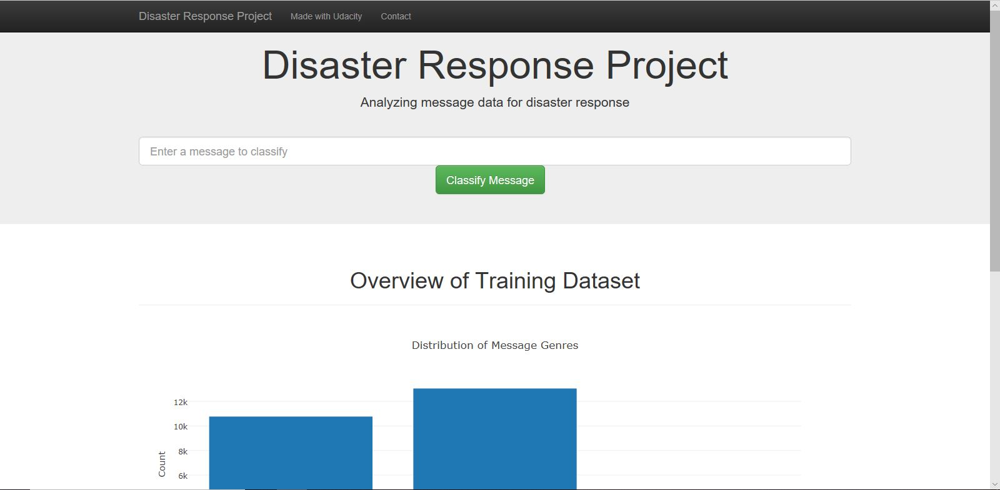

# Disaster Response Pipeline Project

## Project Description
In this project, we will build a model to classify messages that are sent during disasters. There are 36 pre-defined categories, and examples of these categories include Aid Related, Medical Help, Search And Rescue, etc. By classifying these messages, we can allow these messages to be send to the appropriate disaster relief agency. The project will involve the building of a basic ETL and Machine Learning pipeline to facilitate the task. This is also a multi-label classification task, since a message can belong to one or more categories. We will be working with a data set provided by [Figure Eight](https://www.figure-eight.com/) containing real messages that were sent during disaster events.

Two types of models are available to classify the messages. 

    1. The first model type, which is also the default option, is an Adaboost Classifier utilizing Tfidf vectorizer to transform the    messages. 

    2. The second model is an MLP Neural Network utilizing pre-trained GloVe embeddings to transform the messages. It will take the simple average of word vectors to get the message vector.

Finally, this project contains a web app where you can input a message and get classification results.

## File Description
~~~~~~~
        disaster_response_pipeline
          |-- app
                |-- templates
                        |-- go.html
                        |-- master.html
                |-- run.py
          |-- data
                |-- disaster_message.csv
                |-- disaster_categories.csv
                |-- DisasterResponse.db
                |-- ETL Pipeline Preparation.ipynb
                |-- process_data.py
          |-- glove.6B
                |--- glove.6B.50d.txt
                |--- glove.6B.100d.txt
                |--- glove.6B.200d.txt
                |--- glove.6B.300d.txt
          |-- models
                |-- glove_vectorizer.py
                |-- ML Pipeline Preparation.ipynb
                |-- train_classifier.py
~~~~~~~
### Description of key files
1. run.py: Script to run the web app
2. disaster_message.csv: Contains the original disaster messages
3. disaster_categories.csv: Contains the labels of the disaster messages
4. process_data.py: Runs the ETL pipeline to process data from both disaster_message.csv and disaster_categories.csv and load them into an SQLite database, DisasterResponse.db.
5. train_classifier.py: Runs the ML pipeline to classify the messages. The pipeline will build the model, optimize it using grid search and print the model's evaluation. It will then save the classifier model.

## Pre-trained GloVe Embeddings (Optional)
If you want to use the MLP Neural Network model with pre-trained GloVe embeddings, you need to download the pre-trained embeddings from this [link](http://nlp.stanford.edu/data/glove.6B.zip). The downloaded files should be placed in the following folder structure:

~~~~~~~
        disaster_response_pipeline
          |-- app
          |-- data
          |-- glove.6B
               |--- glove.6B.50d.txt
               |--- glove.6B.100d.txt
               |--- glove.6B.200d.txt
               |--- glove.6B.300d.txt
          |-- models
~~~~~~~

## Instructions:
1. In the disaster_response_pipeline directory

    - To run ETL pipeline that cleans data and stores in database
        `python data/process_data.py data/disaster_messages.csv data/disaster_categories.csv data/DisasterResponse.db`
        
    - To run ML pipeline that trains classifier (Adaboost with Tfidf Vectorizer) and saves
        `python models/train_classifier.py data/DisasterResponse.db models/classifier.pkl`
        
    - To run ML pipeline that trains classifier (MLP with GloVe Embeddings) and saves
        `python models/train_classifier.py data/DisasterResponse.db models/classifier.pkl --model_type 2`

2. In the app directory, run the following command to run the web app.
    `python run.py`

3. Go to http://localhost:3001 to view the web app

## Installations
Anaconda, Nltk, re, SQLAlchemy
